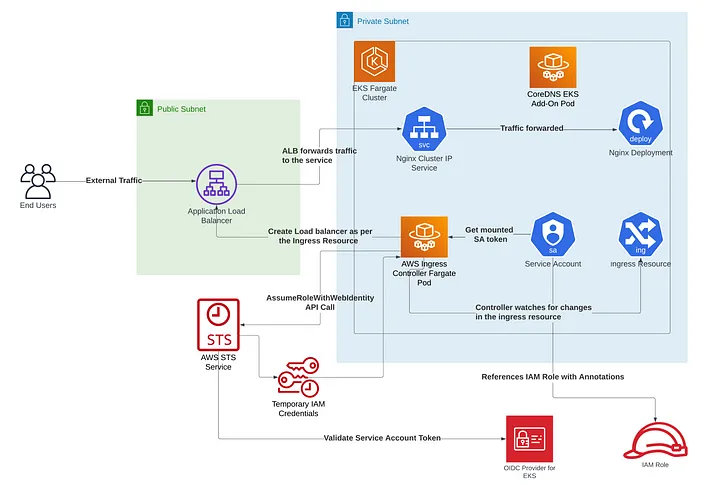
# Create EKS Fargate cluster with EKS Add-Ons & Expose Microservices using AWS Load Balancer Controller
- Hello learners, today we’ll be creating an **EKS Fargate cluster**, and we’ll install some **EKS add-ons** on top of it. We’ll then finally install the **AWS Load Balancer Controller** to **expose** a **microservice**. 
- The diagram above should give a good idea of what we’ll be deploying today. I have shown single public and private subnets to keep the diagram clean & concise but the architecture will be highly available with at least 2 public & private subnets across AZs.
- We'll be creating our entire stack using Terraform which is a popular “Infrastructure as Code” tool.
- Our stack will be deployed in 2 steps. First, we’ll create the cluster, and then the K8s resources. This is done because the K8s and Helm provider in Terraform don’t get initialized properly if we have dynamic references to _kubeconfig_ file, cluster CA certificate, or cluster endpoint which get populated after the cluster is created. In a nutshell, Terraform at the time of this writing doesn’t support _Dynamic Providers_.

## Cluster Creation
- Create a folder _cluster-creation_ and the below files.
- `providers.tf` declares the necessary terraform providers to create the resources.
```terraform
provider "aws" {
}
```
- `variables.tf` declares the necessary input variables that will be used by the different cluster resources
```terraform
variable "aws_region"{
    type = string
}

variable "aws_account"{
    type = string
}

variable "cluster_name"{
    type = string
}

variable "vpc_name"{
    type = string
}
```
- `variables/dev.tfvars` populates the above variables with the user-supplied values. Update the `aws_account` and `vpc_name` with your AWS account ID and VPC name.
```terraform
aws_region="ap-south-1"
aws_account="<Your-AWS-Account-Id>"
cluster_name="fluxcd-fargate"
vpc_name = "<Your-VPC-Name>"
```
- `data.tf` has the necessary data sources to fetch information from external sources for eg. your AWS account.
```terraform
data "aws_vpcs" "vpcs" {
  tags = {
    Name = var.vpc_name
  }
}

data "aws_subnets" "private_subnets" {
  filter {
    name   = "tag:Name"
    values = ["Private Subnet 1", "Private Subnet 2"]
  }
}

data "http" "aws_ingress_controller_iam_policy_github" {
  url = "https://raw.githubusercontent.com/kubernetes-sigs/aws-load-balancer-controller/v2.5.4/docs/install/iam_policy.json"

}
```
- `eks-cluster.tf` defines the EKS cluster and the cluster role. Here the cluster endpoint is configured to be public i.e. API server will be accessible publicly. You can also optionally limit the CIDR blocks that can access your public API server endpoint. If you limit access to specific CIDR blocks, then it is recommended that you also enable the private endpoint access, or ensure that the CIDR blocks that you specify include the addresses that the Fargate Pods use to access the public endpoint.
- We are also defining a cluster role. We have followed the principle of _least-privilege_ here. This permission set allows the Kubernetes cluster to manage nodes but doesn’t allow the legacy cloud provider to create load balancers. This will be taken care of by the AWS Ingress controller which will have its own separate IAM role, as depicted in the diagram above.
```terraform
resource "aws_eks_cluster" "fluxcd_cluster" {
    name     = var.cluster_name
    role_arn = aws_iam_role.eks_cluster_role.arn
    vpc_config {
        endpoint_private_access = false
        endpoint_public_access = true

        subnet_ids = data.aws_subnets.private_subnets.ids
    }
    depends_on = [
        aws_iam_role_policy_attachment.eks_cluster_role_policy_attachment
  ]

}


data "aws_iam_policy_document" "eks_cluster_role_trust_policy" {
  statement {
    effect = "Allow"

    principals {
      type        = "Service"
      identifiers = ["eks.amazonaws.com"]
    }

    actions = ["sts:AssumeRole"]
  }
}

resource "aws_iam_role" "eks_cluster_role" {
  name               = "fluxcd-eks-cluster-role"
}
```
- `create-kubeconfig.tf` as the name suggests, creates a _kubeconfig_ file using _templatefile_ function and _local\_file_ resource which will be used later by the Kubernetes and Helm provider to authenticate and deploy the resource onto the cluster.
```terraform
locals {
  kubeconfig = templatefile("./kubeconfig.tpl", {
    kubeconfig_name                   = aws_eks_cluster.fluxcd_cluster.arn
    endpoint                          = aws_eks_cluster.fluxcd_cluster.endpoint
    cluster_auth_base64               = aws_eks_cluster.fluxcd_cluster.certificate_authority[0].data
    aws_authenticator_command         = "aws" 
    aws_authenticator_command_args    = ["--region", var.aws_region, "eks", "get-token", "--cluster-name", aws_eks_cluster.fluxcd_cluster.name, "--output", "json"]
    aws_authenticator_additional_args = []
    aws_authenticator_env_variables   = {}
  })
}


resource "local_file" "kubeconfig" {
  content  = local.kubeconfig
  filename = "../k8s-resources/kubeconfig/config"
}
```
- `kubeconfig.tpl` defines the structure/template of the _kubeconfig_ file which will be populated once the cluster gets created.
```yaml
apiVersion: v1
preferences: {}
kind: Config

clusters:
- cluster:
    server: ${endpoint}
    certificate-authority-data: ${cluster_auth_base64}
  name: ${kubeconfig_name}

contexts:
- context:
    cluster: ${kubeconfig_name}
    user: ${kubeconfig_name}
  name: ${kubeconfig_name}

current-context: ${kubeconfig_name}

users:
- name: ${kubeconfig_name}
  user:
    exec:
      apiVersion: client.authentication.k8s.io/v1beta1
      command: ${aws_authenticator_command}
      args:
%{~ for i in aws_authenticator_command_args }
        - "${i}"
%{~ endfor ~}
%{ for i in aws_authenticator_additional_args }
        - ${i}
%{~ endfor ~}
```
- `pod-execution-role.tf` as the name suggests defines a pod execution role that is required to run Pods on AWS Fargate infrastructure. When pods are created on your Fargate infrastructure, various actions are performed behind the scenes before the pod is up and running such as pulling container images from Amazon ECR or routing logs to other AWS services. The Amazon EKS Pod execution role provides the IAM permissions to do this.
```terraform
resource "aws_iam_role" "fluxcd_pod_exection_role" {
  name = "fluxcd-generic-pod-execution-role"

  assume_role_policy = jsonencode({
  "Version": "2012-10-17",
  "Statement": [
    {
      "Effect": "Allow",
      "Condition": {
         "ArnLike": {
            "aws:SourceArn": "arn:aws:eks:${var.aws_region}:${var.aws_account}:fargateprofile/${var.cluster_name}/*"
         }
      },
      "Principal": {
        "Service": "eks-fargate-pods.amazonaws.com"
      },
      "Action": "sts:AssumeRole"
    }
  ]
})
}

resource "aws_iam_role_policy_attachment" "fluxcd_pod_exection_role_policy_attachment" {
  policy_arn = "arn:aws:iam::aws:policy/AmazonEKSFargatePodExecutionRolePolicy"
  role       = aws_iam_role.fluxcd_pod_exection_role.name
}
```
- `fargate-profile.tf` as the name suggests defines multiple _Fargate_ profiles that filter out which pods run on the _Fargate_ infrastructure using namespace and label selectors. If a Pod matches multiple Fargate profiles, you can specify which profile a Pod uses by adding the following Kubernetes label to the Pod specification: `eks.amazonaws.com/fargate-profile: _my-fargate-profile._` We are also referring to the above-defined pod execution roles in the below _Fargate_ profiles. Currently, only private subnets with no direct route to an Internet Gateway can be used in a _Fargate_ profile. Below we have defined 3 profiles for _fluxcd_, _aws-ingress-controller_, and _kube-dns_ namespace.
```terraform
resource "aws_eks_fargate_profile" "fluxcd_fargate_profile" {
  cluster_name           = aws_eks_cluster.fluxcd_cluster.name
  fargate_profile_name   = "fluxcd-fargate-profile"
  pod_execution_role_arn = aws_iam_role.fluxcd_pod_exection_role.arn
  subnet_ids             = data.aws_subnets.private_subnets.ids

  selector {
    namespace = "fluxcd"
  }
}

resource "aws_eks_fargate_profile" "aws_ingress_controller_fargate_profile" {
  cluster_name           = aws_eks_cluster.fluxcd_cluster.name
  fargate_profile_name   = "aws-ingress-controller-fargate-profile"
  pod_execution_role_arn = aws_iam_role.fluxcd_pod_exection_role.arn
  subnet_ids             = data.aws_subnets.private_subnets.ids

  selector {
    namespace = "aws-ingress-controller"
  }
}

resource "aws_eks_fargate_profile" "coredns_fargate_profile" {
  cluster_name           = aws_eks_cluster.fluxcd_cluster.name
  fargate_profile_name   = "coredns-fargate-profile"
  pod_execution_role_arn = aws_iam_role.fluxcd_pod_exection_role.arn
  subnet_ids             = data.aws_subnets.private_subnets.ids

  selector {
    namespace = "kube-system"
    labels={
			k8s-app="kube-dns"
		}
  }
}
```
- `irsa.tf` which stands for “IAM roles for service accounts” defines a bunch of resources that let applications running inside pods make AWS API calls using IAM permissions. We have defined an OIDC identity provider by providing the OpenID connect provider URL of our cluster and a thumbprint of the CA that signed the certificate used by the EKS cluster’s OpenID connect provider, both the details which we get from the `tls_certificate` data source. We then define a trust policy document that binds a service account to an IAM role in our case i.e. “aws-ingress-controller” service account in the “aws-ingress-controller” namespace to the “aws-ingress-controller-pod-role” IAM role. Behind the scenes, the service account token that gets mounted onto the pod is exchanged while making an AWS STS `AssumeRoleWithWebIdentity` API operation (thus the audience in the trust policy is “sts.amazonaws.com”, the intended recipient of the mounted OIDC JSON web token). This JWT gets trusted by AWS, thanks to the OIDC provider that we defined below, and temporary IAM role credentials are returned (Access Key and Secret Key) which can then be used to make AWS API calls.
```terraform
data "tls_certificate" "fluxcd_openid_connect_provider_url" {
  url = aws_eks_cluster.fluxcd_cluster.identity[0].oidc[0].issuer
}

resource "aws_iam_openid_connect_provider" "fluxcd_openid_connect_provider" {
  client_id_list  = ["sts.amazonaws.com"]
  thumbprint_list = [data.tls_certificate.fluxcd_openid_connect_provider_url.certificates[0].sha1_fingerprint]
  url             = data.tls_certificate.fluxcd_openid_connect_provider_url.url
}

data "aws_iam_policy_document" "aws_ingress_controller_trust_policy" {
  statement {
    actions = ["sts:AssumeRoleWithWebIdentity"]
    effect  = "Allow"

    condition {
      test     = "StringEquals"
      variable = "${replace(aws_iam_openid_connect_provider.fluxcd_openid_connect_provider.url, "https://", "")}:sub"
      values   = ["system:serviceaccount:aws-ingress-controller:aws-ingress-controller"]
    }

    condition {
      test     = "StringEquals"
      variable = "${replace(aws_iam_openid_connect_provider.fluxcd_openid_connect_provider.url, "https://", "")}:aud"
      values   = ["sts.amazonaws.com"]
    }

    principals {
      identifiers = [aws_iam_openid_connect_provider.fluxcd_openid_connect_provider.arn]
      type        = "Federated"
    }
  }
}
```
- `aws-ingress-controller-policy.tf` defines the IAM policy which we get from the _http_ data source we had defined in _data.tf_ and attaches to the IAM role defined above. In a nutshell, this policy allows the “aws-ingress-controller” pods to create ALBs/NLBs whenever a Kubernetes ingress or a service resource is created.
```terraform
resource "aws_iam_policy" "aws_ingress_controller_iam_policy" {
  name        = "aws_ingress_controller_policy"
  policy = data.http.aws_ingress_controller_iam_policy_github.response_body
}

resource "aws_iam_role_policy_attachment" "aws_ingress_controller_role_policy_attachment" {
  policy_arn = aws_iam_policy.aws_ingress_controller_iam_policy.arn
  role       = aws_iam_role.aws_ingress_controller_pod_role.name
}
```
- `vpc-cni-amazon-eks-addon.tf` defines an EKS add-on for the _VPC CNI_ plugin. EKS add-ons are a curated set of add-on software for Amazon EKS clusters. Their upgrades are managed by AWS. We get notified whenever an upgrade for an EKS add-on is available. All EKS add-ons include the latest security patches and bug fixes. We can even update specific Amazon EKS-managed configuration fields for Amazon EKS add-ons through the Amazon EKS API. In a nutshell, the operational overhead of running and managing a supporting operational software on EKS is taken care of by AWS using EKS add-ons. Below we have defined a trust policy document that allows _vpc-cni_ pods running using the _aws-node_ service account in the _kube-system_ namespace to assume the “fluxcd-vpc-cni-plugin-role” IAM role. The policy allows assigning a private `IPv4` or `IPv6` address from your VPC to each Node, Pod, and service in your cluster. Notice how we have commented out the _kubernetes\_annotations_ resource, this is because the EKS add-on takes care of adding the `eks.amazonaws.com/role-arn` annotation to the _aws-node_ service account.
> Important Note! **No need to create the VPC CNI EKS Add-On**, as on Fargate this pluging is managed by AWS itself. Plus even if you try to install the below add-on, it won’t make any difference as daeomon-sets are not supported on Fargate **(There is no conecept of nodes, Remember!_)_**. Above information will be relevant for EKS running on Node Groups, **you can safely skip this tf file**.
```terraform
data "aws_iam_policy_document" "vpc_cni_plugin_trust_policy" {
  statement {
    actions = ["sts:AssumeRoleWithWebIdentity"]
    effect  = "Allow"

    condition {
      test     = "StringEquals"
      variable = "${replace(aws_iam_openid_connect_provider.fluxcd_openid_connect_provider.url, "https://", "")}:sub"
      values   = ["system:serviceaccount:kube-system:aws-node"]
    }

    condition {
      test     = "StringEquals"
      variable = "${replace(aws_iam_openid_connect_provider.fluxcd_openid_connect_provider.url, "https://", "")}:aud"
      values   = ["sts.amazonaws.com"]
    }

    principals {
      identifiers = [aws_iam_openid_connect_provider.fluxcd_openid_connect_provider.arn]
      type        = "Federated"
    }
  }
}


resource "aws_iam_role" "vpc_cni_plugin_role" {
  assume_role_policy = data.aws_iam_policy_document.aws_ingress_controller_trust_policy.json
  name               = "fluxcd-vpc-cni-plugin-role"
}

resource "aws_iam_role_policy_attachment" "vpc_cni_plugin_policy_attachment" {}
```
- `coredns-amazon-eks-addon.tf` defines the EKS add-on for CoreDNS which is an extensible DNS server and provides name resolution for all Pods in the cluster. We have given a configuration value of compute type as _Fargate_ to make it run on our cluster_._ There is a _depends\_on_ section as well which explicitly tells Terraform to create the _CoreDNS Fargate_ profile before installing the add-on, as without the Fargate profile the CoreDNS pods won’t be able to get scheduled on the Fargate infrastructure and would remain in a pending state.
```terraform
resource "aws_eks_addon" "coredns_amazon_eks_addon" {
  cluster_name                = aws_eks_cluster.fluxcd_cluster.name
  addon_name                  = "coredns"
  addon_version               = "v1.10.1-eksbuild.6" 
  resolve_conflicts_on_create = "OVERWRITE"
  resolve_conflicts_on_update = "PRESERVE"
  configuration_values        = jsonencode({
        computeType = "Fargate"
      })
  depends_on = [
    aws_eks_fargate_profile.coredns_fargate_profile    #for coredns profile to get created before the fagate coredns pods don't go in pending state
  ]
}
```
- This wraps up our first part of the setup. Now let's create the cluster!
- Add the below tags to your VPC and subnets for the EKS cluster to function correctly. Make sure you are using the correct names in the below tags for your VPC, subnet, and EKS cluster. These tags also help in subnet auto-discovery for the AWS Ingress Controller. When the ingress controller tries to create a public ALB, it looks for the `kubernetes.io/role/elb` tag on the subnets with the value 1 or ‘’.
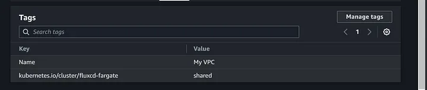
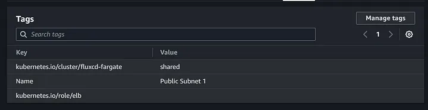
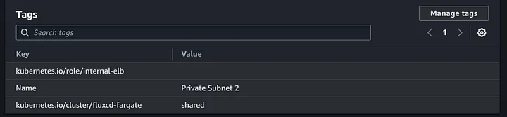
- Run the below commands:
```shell
cd cluster-creation
terraform apply -var-file variables/dev.tfvars -refresh=false
```
- Wait for _terraform apply_ to succeed. It might take 5–15 minutes. After the apply is successful you will see a _kubeconfig_ file created at the location `k8s-resources\kubeconfig\config` , which will be utilized by the Kubernetes and Helm provider of Terraform to deploy the resources on our _fluxcd-fargate_ EKS cluster.

## K8s Resources Creation
- Create the below files under `k8s-resources` folder
- `providers.tf` declares the necessary terraform providers to create the resources.
```terraform
provider "aws" {
}

provider "kubernetes" {
  config_path    = "./kubeconfig/config"
}

provider "helm" {
  kubernetes {
    config_path = "./kubeconfig/config"
  }
}
```
- `variables.tf` declares the necessary input variables that will be used by the different k8s resources
```terraform
variable "aws_region"{
    type = string
}

variable "aws_account"{
    type = string
}

variable "cluster_name"{
    type = string
}

variable "aws_ingress_controller_pod_role"{
    type = string
}

variable "vpc_name"{
    type = string
}
```
- `variables/dev.tfvars` populates the above variables with the user-supplied values. Update the `aws_account` and `vpc_name` with your AWS account ID and VPC name.
```terraform
aws_region="ap-south-1"
aws_account="<Your-Aws-Account-Id>"
cluster_name="fluxcd-fargate"
aws_ingress_controller_pod_role = "aws-ingress-controller-pod-role"
vpc_name = "<Your-VPC-Name>"
```
- `data.tf` has the necessary data sources to fetch information from external sources for eg. your AWS account.
```terraform
data "aws_vpcs" "vpcs" {
  tags = {
    Name = var.vpc_name
  }
}
```
- `fluxcd-namespace.tf` defines a k8s namespace with the name _fluxcd._
```terraform
resource "kubernetes_namespace" "fluxcd_namespace" {
  metadata {
    name = "fluxcd"
  }
}
```
- `nginx-service.tf` defines a _ClusterIP_ service with the name _nginx_ in the _fluxcd_ namespace and exposes port 80.
```terraform
resource "kubernetes_service" "nginx" {
  metadata {
    name = "nginx"
    namespace = kubernetes_namespace.fluxcd_namespace.metadata[0].name
  }
  spec {
    selector = {
      app = "nginx"
    }
    port {
      port        = 80
    }

    type = "ClusterIP"
  }
}
```
- `nginx-service-account.tf` defines a service account with the name _nginx_ in the _fluxcd_ namespace.
```terraform
resource "kubernetes_service_account" "nginx" {
  metadata {
    name = "nginx"
    namespace = "fluxcd"
  }
}
```
- `nginx-deployment.tf` defines an _nginx_ deployment in the _fluxcd_ namespace. This is the microservice that we will be exposing using the AWS Ingress Controller. It uses the public `nginx:1.21.6` image.
```terraform
resource "kubernetes_deployment" "nginx" {
  metadata {
    name = "nginx"
    namespace = kubernetes_namespace.fluxcd_namespace.metadata[0].name
    labels = {
      app = "nginx"
    }
  }

  spec {
    replicas = 1

    selector {
      match_labels = {
        app = "nginx"
      }
    }

    template {
      metadata {
        labels = {
          app = "nginx"
        }
      }

      spec {
        service_account_name = kubernetes_service_account.nginx.metadata[0].name
        container {
          image = "nginx:1.21.6"
          name  = "nginx"
        }
      }
  }
}
```
- `aws-ingress-controller.tf` defines a bunch of resources. Let's take a look at them one by one. Firstly we define a k8s namespace with the name _aws-ingress-controller. _We then define a k8s service account and provide the AWS Ingress Controller IAM role ARN as the `eks.amazonaws.com/role-arn` annotation, which lets the controller pod assume this role and create/update load balancers on your behalf. Then we define a k8s cluster role, give it the appropriate permissions, and bind it to the _aws-ingress-controller_ service account. We then define a helm chart that creates the actual controller deployment of some other resources including a custom resource definition i.e _TargetGroupBinding_. We also pass input values to the helm chart such as the service account name, vpc id, cluster name, region, etc. We then finally define the ingress resource which exposes the nginx service at path `/` on port 80. The AWS Ingress Controller continuously watches for changes in ingress resources that have their ingress class set as “alb” and then creates the application load balancers in AWS with the appropriate listener rules and target groups as mentioned in the ingress resource. Note that we have given an annotation of `alb.ingress.kubernetes.io/scheme` as `internet-facing,` this will create the load balances ENIs in the public subnets which is necessary as the traffic is coming from the internet.
```terraform
resource "kubernetes_namespace" "aws_ingress_controller_namespace" {
  metadata {
    name = "aws-ingress-controller"
  }
}

resource "kubernetes_service_account" "aws_ingress_controller_service_account" {
  metadata {
    name = "aws-ingress-controller"
    namespace = "aws-ingress-controller"
    labels = {
        "app.kubernetes.io/component" = "controller"
        "app.kubernetes.io/name" = "aws-load-balancer-controller"
    }
    annotations = {
      "eks.amazonaws.com/role-arn" = "arn:aws:iam::${var.aws_account}:role/${var.aws_ingress_controller_pod_role}"
    }
  }
}

resource "kubernetes_cluster_role" "aws-ingress-controller-cluster-role" {
  metadata {
    name = "aws-ingress-controller"
    labels = {
      "app.kubernetes.io/name" = "aws-ingress-controller"
    }
  }

  rule {
    api_groups = ["","extensions"]
    resources  = ["configmaps", "endpoints", "events", "ingresses", "ingresses/status", "services"]
    verbs      = ["get", "list", "watch", "create", "update", "patch"]
  }
}
```
- This wraps up our second part of the setup. Now let’s deploy these resources!
- Run the below commands. Wait for _terraform apply_ to succeed. It might take 5–15 minutes.
```shell
cd ../k8s-resources
terraform apply -var-file variables/dev.tfvars -refresh=false
```
- Now let's take a look at the below screenshots, to get a better understanding of our entire setup!
- CoreDNS Add-On is installed and is in an `Active` state.
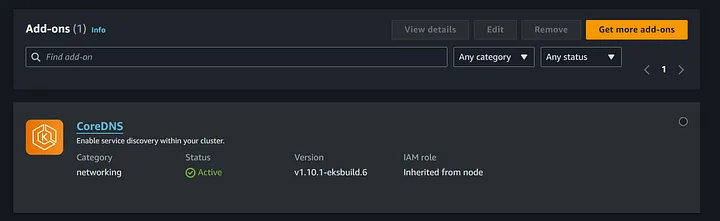
- All 3 Fargate profiles were created and are in an Active state
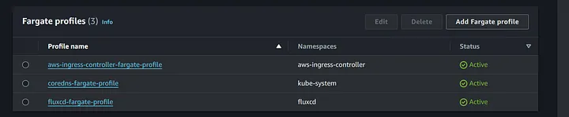
- A total of 5 pods are running, for CoreDNS, AWS ingress controller, and Nginx.
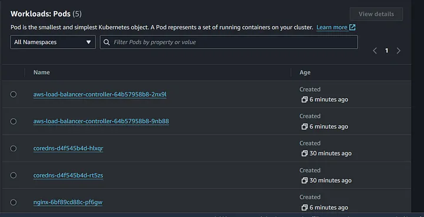
- The AWS Ingress controller has created the below application load balancer as per the configuration we had passed in the ingress resource. Note that the name of the load balancer is derived from the namespace name in which we had created the ingress resource plus the name of the ingress resource itself.
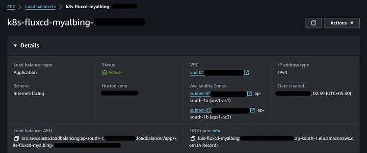
- A listener is created, accepting traffic on port 80. 2 listener rules are also created, forwarding traffic with the path `/*` to the nginx target group. Note that, a 404 default rule was created which might confuse some readers. This was created because we didn’t specify any `default_backend` in the ingress resource.
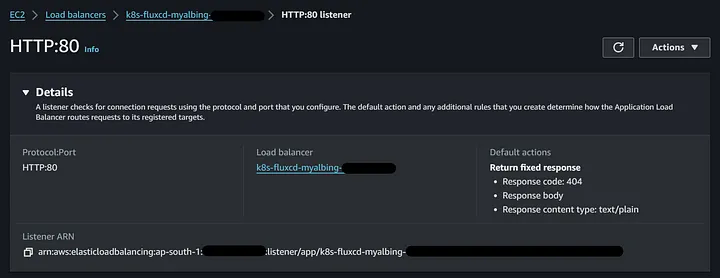
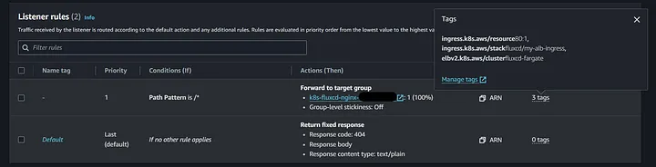
- A target group is also created, accepting traffic on port 80. Our nginx pod was successfully registered with the target group and is in a healthy state. The target type is IP, the registered IP is of the nginx pod itself, the same can be confirmed in the below screenshots.
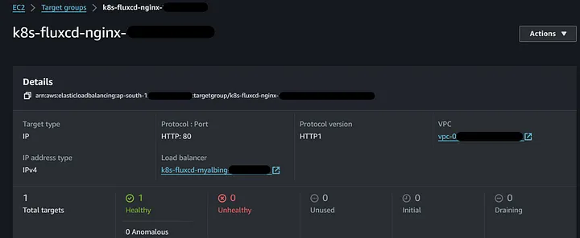
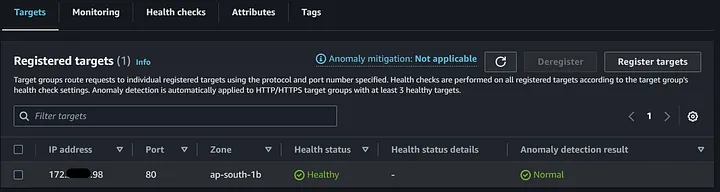
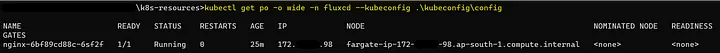
- The AWS LoadBalancer controller internally uses a custom resource called _TargetGroupBinding_ to support the functionality for Ingress and Service resources. It automatically creates TargetGroupBinding in the same namespace as the target service used in the ingress resource. You can also use a _TargetGroupBinding_ to expose your pods using an existing ALB TargetGroup or NLB TargetGroup. This will allow you to provision the load balancer infrastructure completely outside of Kubernetes but still manage the targets with Kubernetes Service. In a nutshell, it is also a controller within the AWS LoadBalancer controller that watches for changes in your backend pods, whenever a new pod is created or an existing pod is deleted in your backend service, it updates the target group in AWS by registering or de-registering the target pods.
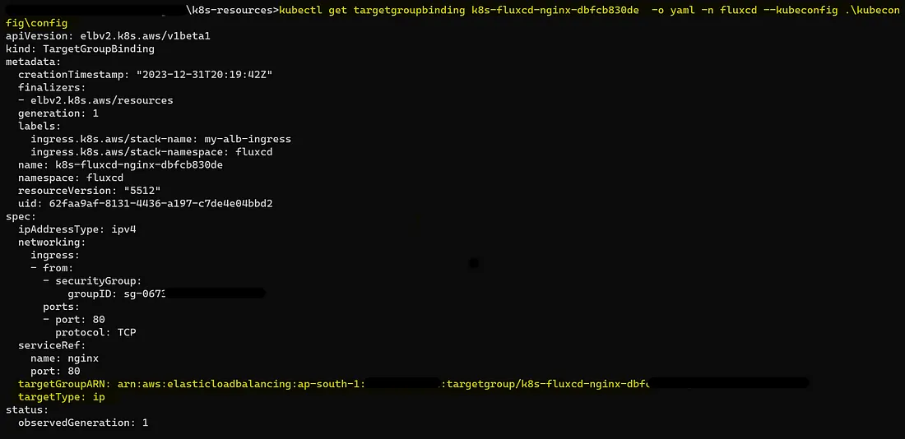
- If we peek into the AWS ingress controller pod logs, we can see it is creating multiple resources such as load balancer, target group, listener rule, etc.
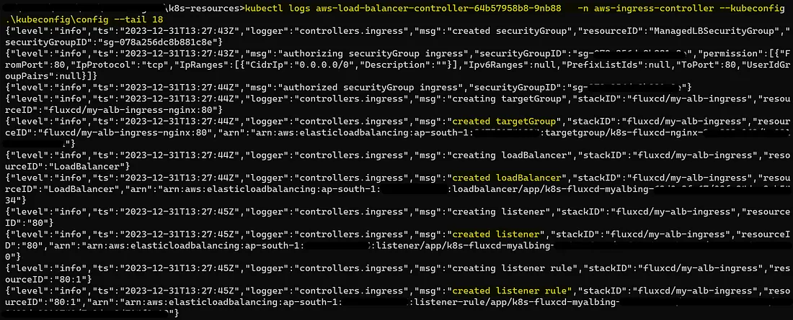
- Finally, let’s hit the load balancer DNS and see if our Nginx pod responds.
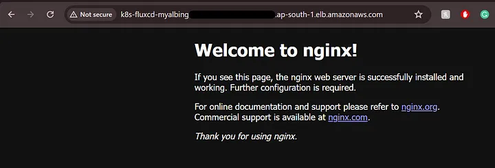
- Whoa!, we got the **Nginx Welcome Page!**
- Now let’s hit our load balancer at a path that we know doesn’t exist in our backend pod, just to get a fun 404 error!
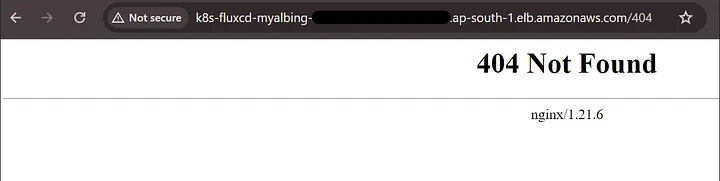
- The same can be observed from our Nginx pod logs, the requests are going through!
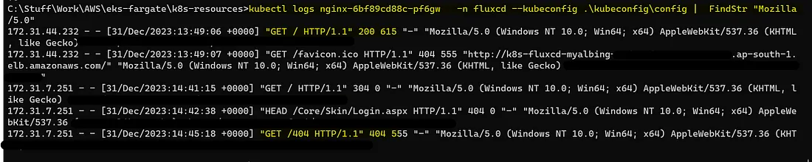
- To keep your AWS bills in check, destroy the infrastructure as soon you are done creating and testing the entire setup.
- Run the below commands
```shell
cd cluster-creation
terraform destroy --auto-approve -var-file variables/dev.tfvars
cd k8s-resources
terraform destroy --auto-approve -var-file variables/dev.tfvars
```
- This marks the end of our “**_Create EKS Fargate cluster with EKS Add-Ons & Expose Microservices using AWS Ingress Controller_**” blog.  
- If you have any questions/suggestions please add them in the comments.  
- If you learned anything new today, please consider giving a clap👏, it keeps me motivated to write more AWS content. 😀
