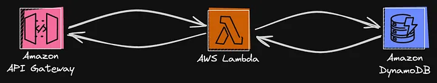

# Chat room with serverless architecture
- This article is about how to build a chat room with serverless architecture.

## Introduction
- When we talk about a simple chat room, this chat room will need some features. At first, users should have the ability to send the message to the chat room. Second, the users should be able to receive messages from other people in the chat room. These two are the main functions of a simple chat room. Here, I will introduce how to build a chat room via Go step by step.

## Functional requirements
1.  As a service, the chat room should be able to know who has joined the room.
2.  As a user, I should be able to connect and disconnect to a chat room.
3.  As a user, I should have the ability to send and receive messages in chat rooms that I join.

## Components
We will need some components below to build the serverless architecture.
* AWS Lambda
* 
Processes chat events (messages, connection, disconnection) and authorization.
* DynamonDB

A NoSQL database used to store the chat messages, connection information and user information.
* API Gateway

Handles real-time communication between clients (browsers, mobile apps, etc.) and your backend.
With these three components, the architecture will look like this.


## DynamoDB
- Because DynamoDB is not like the relational databases, the schema design of DynamoDB will be slightly different from traditional one. The single-table design might be suitable for DynamoDB according to the [_article_](https://www.alexdebrie.com/posts/dynamodb-single-table/#the-solution-pre-join-your-data-into-item-collections), so I will use this pattern to design the schema.

```
| Entity           | PK               | SK                     | Attributes                     |
| ---------------- | ---------------- | ---------------------- | ------------------------------ |
| User information | `USER#{email}`   | `USER#{email}`         | `Username`, `Password`, `Salt` |
| History message  | `ROOM#{room_id}` | `MESSAGE#{timestamp}`  | `From`, `Content`, `TTL`       |
| Connections      | `ROOM#{room_id}` | `CONN#{connection_id}` |                                |
```
- Here to simplify the example, I won’t design the room manager, and set the room id from 1 to 5. The history messages will only keep in 7 days, and the data will be remove via the `TTL` attribute.
- As for deployment, the `terraform` code is as follows.

```
### DynamoDB Table ###
resource "aws_dynamodb_table" "chat_room" {
  name         = "ChatRoom"
  billing_mode = "PAY_PER_REQUEST"
  hash_key     = "PK"
  range_key    = "SK"
  attribute {
    name = "PK"
    type = "S"
  }
  attribute {
    name = "SK"
    type = "S"
  }
  ttl {
    attribute_name = "TTL"
    enabled        = true
  }
}
```

## AWS Lambda
- Before setting up a Lambda function written by Go, we need to know something according to this [_article_](https://docs.aws.amazon.com/lambda/latest/dg/golang-package.html). The output file name should be `**bootstrap**` and the `Runtime` should be `**provided.al2023**` or `**provided.al2**`**.**
- As for deployment, the `terraform` code is as follows.

```
### build the binary for the lambda function in a specified path
resource "null_resource" "chat_connect" {
  provisioner "local-exec" {
    command     = "GOOS=linux GOARCH=arm64 go build -tags lambda.norpc -o {PATH FOR OUTPUT} {INPUT GO FILE}"
    working_dir = "{GO MOD PATH}"
  }
}
### zip the binary, as we can use only zip files to AWS lambda
data "archive_file" "chat_connect_archive" {
  depends_on = [null_resource.chat_connect]
  type        = "zip"
  source_file = "{OUTPUT PATH FILE}"
  output_path = "{ZIP FILE PATH FOR OUTPUT}"
}
### Lambda Functions for WebSocket Routes ###
resource "aws_lambda_function" "connect" {
  function_name    = "ConnectFunction"
  role             = aws_iam_role.lambda_role.arn
  handler          = local.binary_file
  runtime          = "provided.al2023"
  architectures    = ["arm64"]
  filename         = local.chat_connect_archive_path
  source_code_hash = data.archive_file.chat_connect_archive.output_base64sha256
  environment {
    variables = {
      SECRET     = random_string.random.result
      TABLE_NAME = aws_dynamodb_table.chat_room.name
    }
  }
}
```

## Register Lambda
- The main purpose is to create a piece of new user information and store it in DynamoDB. To implement it, the function needs the ability to `GetItem` and `PutItem` on DynamoDB. `GetItem` is used to check if the email is used. `PutItem` is used to store the user information.
- The function code is [HERE](./src/go-pkg/internal/handler/auth/register/register.go).

## Login Lambda
- The main purpose is to verify the user and return the JSON Web Token if the authentication is successful. To implement it, the function needs the ability to `GetItem`on DynamoDB. The token will include `email`, `room_id`, and `expire`.
- The function code is [HERE](./src/go-pkg/internal/handler/auth/login/login.go).

## Connect Lambda
- This function will store connection details (like connection ID) in a DynamoDB table to track active users. To implement it, the function needs the ability to `PutItem`on DynamoDB.
- The function code is [HERE](./src/go-pkg/internal/handler/chat/connect/connect.go).

## Disconnect Lambda
- The function will clean up connection details from DynamoDB when a client disconnects. To implement it, the function needs the ability to `DeleteItem`on DynamoDB.
- The function code is [HERE](./src/go-pkg/internal/handler/chat/disconnect/disconnect.go).

## Send Message Lambda
- The main goal of this feature is to transfer messages from the client to other people in the same chat room and store the message in DynamoDB for queries. To implement it, the function needs the ability to `PutItem` and `Query` on DynamoDB.
- The function code is [HERE](./src/go-pkg/internal/handler/chat/send-message/sendMessage.go).

# Authentication Middleware
- Since all chat events require authentication, it might make more sense to write a middleware to reuse it on different functions.
- The function code is [HERE](./src/go-pkg/internal/handler/common/middleware.go).

## API Gateway
- The API gateway will be divided into `WebSocket` and `HTTP`. The `WebSocket` will address `connect`, `disconnect`, and `send message` functions. As for `HTTP`, it will handle `register` and `login` functions. The `connect` lambda function will be triggered when a client connects via the `$connect` router. On the other hand, the `disconnect` one will be triggered when a client disconnects via the `$disconnect` router. As for `send message` function, its router is custom, `sendMessage`.
- Back to the `Http` API gateway, it is a common RESTful API. The router of `register` is `POST /auth/v1/register` and the router of `login` is `POST /auth/v1/login`.
- As for deployment, the `terraform` code is as follows.

```
### API Gateway WebSocket API ###
resource "aws_apigatewayv2_api" "websocket_api" {
  name                       = "WebSocketChatAPI"
  protocol_type              = "WEBSOCKET"
  route_selection_expression = "$request.body.action"
}
### API Gateway HTTP API ###
resource "aws_apigatewayv2_api" "http_api" {
  name          = "HTTPChatAPI"
  protocol_type = "HTTP"
}
### API Gateway Integrations ###
resource "aws_apigatewayv2_integration" "connect" {
  api_id           = aws_apigatewayv2_api.websocket_api.id
  integration_type = "AWS_PROXY"
  integration_uri  = aws_lambda_function.connect.invoke_arn
}
resource "aws_apigatewayv2_integration" "auth_register" {
  api_id                 = aws_apigatewayv2_api.http_api.id
  integration_type       = "AWS_PROXY" # AWS_PROXY enables Lambda proxy integration
  integration_uri        = aws_lambda_function.register.invoke_arn
  payload_format_version = "2.0" # For HTTP APIs, use payload version 2.0
}
### API Gateway Routes ###
resource "aws_apigatewayv2_route" "connect_route" {
  api_id    = aws_apigatewayv2_api.websocket_api.id
  route_key = "$connect"
  target    = "integrations/${aws_apigatewayv2_integration.connect.id}"
}
resource "aws_apigatewayv2_route" "auth_register_route" {
  api_id    = aws_apigatewayv2_api.http_api.id
  route_key = "POST /auth/v1/register" # Defines HTTP method and path
  target    = "integrations/${aws_apigatewayv2_integration.auth_register.id}"
}
```

## IAM (Identity and Access Management)
- Because DynamoDB, Lambda, and API Gateway are independent services, when one service needs to access another service, permissions will be required.
- The `IAM` deployment will be as follows.

```
### IAM Role for Lambda Functions ###
resource "aws_iam_role" "lambda_role" {
  name = "LambdaRole"
  assume_role_policy = jsonencode({
    "Version" : "2012-10-17",
    "Statement" : [
      {
        "Effect" : "Allow",
        "Principal" : {
          "Service" : "lambda.amazonaws.com"
        },
        "Action" : "sts:AssumeRole"
      }
    ]
  })
}
### IAM Policies ###
# Policy for DynamoDB Access
resource "aws_iam_policy" "dynamodb_policy" {
  name        = "DynamoDBAccessPolicy"
  description = "Policy for Lambda to access DynamoDB tables."
  policy = jsonencode({
    "Version" : "2012-10-17",
    "Statement" : [
      {
        "Effect" : "Allow",
        "Action" : [
          "dynamodb:GetItem",
          "dynamodb:PutItem",
          "dynamodb:DeleteItem",
          "dynamodb:Query"
        ],
        "Resource" : [
          aws_dynamodb_table.chat_room.arn
        ]
      }
    ]
  })
}
# Policy for API Gateway Management (WebSocket)
resource "aws_iam_policy" "manage_connections_policy" {
  name        = "ApiGatewayManageConnectionsPolicy"
  description = "Policy for Lambda to manage API Gateway WebSocket connections."
  policy = jsonencode({
    "Version" : "2012-10-17",
    "Statement" : [
      {
        "Effect" : "Allow",
        "Action" : "execute-api:ManageConnections",
        "Resource" : "*"
      }
    ]
  })
}
### Attach Policies to IAM Role ###
resource "aws_iam_role_policy_attachment" "attach_dynamodb_policy" {
  role       = aws_iam_role.lambda_role.name
  policy_arn = aws_iam_policy.dynamodb_policy.arn
}
resource "aws_iam_role_policy_attachment" "attach_manage_connections_policy" {
  role       = aws_iam_role.lambda_role.name
  policy_arn = aws_iam_policy.manage_connections_policy.arn
}
resource "aws_iam_role_policy_attachment" "lambda_basic_execution" {
  role       = aws_iam_role.lambda_role.name
  policy_arn = "arn:aws:iam::aws:policy/service-role/AWSLambdaBasicExecutionRole"
}
```
