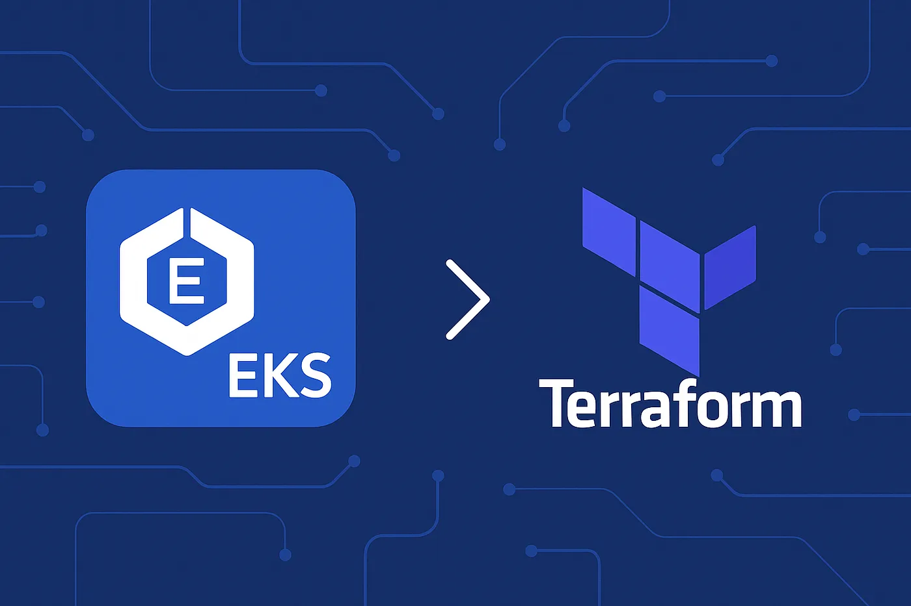

# Deploying a Scalable EKS Infrastructure with Terraform
- The goal of this article is to provide a 10-step process of deploying production grade Amazon EKS clusters using Infrastructure as Code tool — TERRAFORM.
- Before you dive in, grab a cup of coffee and get ready to build a robust EKS cluster with Terraform — because even DevOps requires a little brew to power through complex setups!
1. Key Components 
   - AWS EKS: Managed Kubernetes cluster. 
   - Terraform: Infrastructure as Code tool for resource provisioning. 
   - Modules: Separated code for VPC (networking) and EKS cluster resources. 
   - Remote State: S3 for Terraform state storage and DynamoDB for state locking.

2. Prerequisites
- Installations and Tools:
  - AWS CLI 
  - Terraform 
  - eksctl (for additional Kubernetes interactions)
  - Visual Studio Code (optional, with HashiCorp Terraform plugin)

- AWS Credentials Setup:
```shell
aws configure
```

3. Directory Structure & Modularization
- Folder organization:
```shell
root/
├── backend/
├── modules/
│    ├── vpc/
│    └── eks/
├── main.tf
├── outputs.tf
└── variables.tf
```
- Purpose:
  - `modules/vpc`: Contains the configuration for VPC, subnets, IGW, NAT, and routing tables. 
  - `modules/eks`: Houses resources to provision the EKS control plane and node groups.

4. Configuring the Remote Backend
- Terraform Backend Configuration (in root/main.tf):
```terraform
terraform {
  required_providers {
    aws = {
      source  = "hashicorp/aws"
      version = "~> 5.0"
    }
  }
  backend "s3" {
    bucket         = "remote-backend-s3"
    key            = "terraform.tfstate"
    region         = "us-west-2"
    dynamodb_table = "remote-backend-locks"
    encrypt        = true
  }
}

provider "aws" {
  region = var.region
}
```
- Initialization and Plan Commands:
```shell
terraform init
terraform plan
```
5. VPC and Networking Setup
- VPC Module Components (modules/vpc/main.tf):
  - Create VPC:
```terraform
resource "aws_vpc" "main" {
  cidr_block           = var.vpc_cidr
  enable_dns_support   = true
  enable_dns_hostnames = true
  tags = {
    Name = "${var.cluster_name}-vpc"
  }
}
```
	- Subnets: We can use loops over CIDR blocks to create both public and private subnets i.e we define multiple public and private subnets by iterating over a list of CIDR blocks using Terraform’s count or for_each construct. This ensures scalable and consistent subnet creation across multiple AZ’s
	- Variables.tf
```terraform
variable "vpc_id" {
  description = "VPC ID to associate subnets with"
  type        = string
}

variable "availability_zones" {
  description = "List of availability zones"
  type        = list(string)
}

variable "public_subnet_cidrs" {
  description = "CIDR blocks for public subnets"
  type        = list(string)
}

variable "private_subnet_cidrs" {
  description = "CIDR blocks for private subnets"
  type        = list(string)
}

variable "cluster_name" {
  description = "Name of the EKS cluster"
  type        = string
}
```
	- Public Subnets (main.tf)
```terraform
resource "aws_subnet" "public" {
  count                   = length(var.public_subnet_cidrs)
  vpc_id                  = var.vpc_id
  cidr_block              = var.public_subnet_cidrs[count.index]
  availability_zone       = var.availability_zones[count.index]
  map_public_ip_on_launch = true

  tags = {
    Name                             = "${var.cluster_name}-public-${count.index + 1}"
    "kubernetes.io/cluster/${var.cluster_name}" = "shared"
    "kubernetes.io/role/elb"         = "1"
  }
}
```

	- Private Subnets (main.tf)
```terraform
resource "aws_subnet" "private" {
  count             = length(var.private_subnet_cidrs)
  vpc_id            = var.vpc_id
  cidr_block        = var.private_subnet_cidrs[count.index]
  availability_zone = var.availability_zones[count.index]

  tags = {
    Name                             = "${var.cluster_name}-private-${count.index + 1}"
    "kubernetes.io/cluster/${var.cluster_name}" = "shared"
    "kubernetes.io/role/internal-elb" = "1"
  }
}
```

    - Internet gateway & NAT gateway: For external internet access, define gateways
```terraform
resource "aws_internet_gateway" "main" {
  vpc_id = aws_vpc.main.id
  tags = { Name = "${var.cluster_name}-igw" }
}
resource "aws_nat_gateway" "main" {
  count         = length(var.public_subnet_cidrs)
  allocation_id = aws_eip.nat[count.index].id
  subnet_id     = aws_subnet.public[count.index].id
  tags = { Name = "${var.cluster_name}-nat-${count.index + 1}" }
}
```

    - Routing: Define public and private route tables to associate with respective subnets
```terraform
# Public Route Table
resource "aws_route_table" "public" {
  vpc_id = var.vpc_id

  route {
    cidr_block = "0.0.0.0/0"
    gateway_id = aws_internet_gateway.igw.id  # The Internet Gateway attached to your VPC.
  }

  tags = {
    Name = "${var.cluster_name}-public-rt"
  }
}

resource "aws_route_table_association" "public" {
  count          = length(var.public_subnet_cidrs)
  subnet_id      = aws_subnet.public[count.index].id
  route_table_id = aws_route_table.public.id
}

# Private Route Table
resource "aws_route_table" "private" {
  count  = length(var.private_subnet_cidrs)
  vpc_id = var.vpc_id

  route {
    cidr_block     = "0.0.0.0/0"
    nat_gateway_id = aws_nat_gateway.main[count.index].id  # Each private route table uses the corresponding NAT Gateway.
  }

  tags = {
    Name = "${var.cluster_name}-private-rt-${count.index + 1}"
  }
}

resource "aws_route_table_association" "private" {
  count          = length(var.private_subnet_cidrs)
  subnet_id      = aws_subnet.private[count.index].id
  route_table_id = aws_route_table.private[count.index].id
}
```

6. Setting Up IAM Roles for EKS
- A key component of the EKS deployment is securely setting up IAM roles. This section details two primary roles: one for the EKS control plane and one for the worker (node) groups. 
  - A. EKS Cluster Role
    - Purpose: Allows the EKS control plane to manage AWS resources required for operations (such as creating ENIs, attaching security groups, and managing load balancers). 
      - Creation of the Cluster Role:
```terraform
resource "aws_iam_role" "eks_cluster_role" {
  name = "${var.cluster_name}-eks-cluster-role"
  assume_role_policy = jsonencode({
    Version = "2012-10-17",
    Statement = [{
      Effect    = "Allow",
      Principal = { Service = "eks.amazonaws.com" },
      Action    = "sts:AssumeRole"
    }]
  })
}
```
      - Attach Required AWS MANAGED Policies:
```terraform
resource "aws_iam_role_policy_attachment" "eks_cluster_policy" {
  role       = aws_iam_role.eks_cluster_role.name
  policy_arn = "arn:aws:iam::aws:policy/AmazonEKSClusterPolicy"
}
resource "aws_iam_role_policy_attachment" "eks_service_policy" {
  role       = aws_iam_role.eks_cluster_role.name
  policy_arn = "arn:aws:iam::aws:policy/AmazonEKSServicePolicy"
}
```
  - B. EKS (Worker) Node Role
    - Purpose: Grants worker nodes the permissions to interact with other AWS services, such as pulling container images from Amazon ECR, sending logs to CloudWatch, and interacting with the EKS control plane.
      - Creation of the Node Role:
```terraform
resource "aws_iam_role" "eks_node_role" {
  name = "${var.cluster_name}-eks-node-role"
  assume_role_policy = jsonencode({
    Version = "2012-10-17",
    Statement = [{
      Effect    = "Allow",
      Principal = { Service = "ec2.amazonaws.com" },
      Action    = "sts:AssumeRole"
    }]
  })
}
```
      - Attach Required AWS MANAGED Policies:
```terraform
resource "aws_iam_role_policy_attachment" "eks_worker_policy" {
  role       = aws_iam_role.eks_node_role.name
  policy_arn = "arn:aws:iam::aws:policy/AmazonEKSWorkerNodePolicy"
}
resource "aws_iam_role_policy_attachment" "ecr_readonly_policy" {
  role       = aws_iam_role.eks_node_role.name
  policy_arn = "arn:aws:iam::aws:policy/AmazonEC2ContainerRegistryReadOnly"
}
resource "aws_iam_role_policy_attachment" "eks_cni_policy" {
  role       = aws_iam_role.eks_node_role.name
  policy_arn = "arn:aws:iam::aws:policy/AmazonEKS_CNI_Policy"
}
```
  - C. Integration into the EKS Module
    - Reference in the EKS cluster provisioning: Pass the IAM role ARNs to your EKS cluster.
```terraform
resource "aws_eks_cluster" "main" {
  name     = var.cluster_name
  version  = var.cluster_version
  role_arn = aws_iam_role.eks_cluster_role.arn
  vpc_config {
    subnet_ids = var.subnet_ids
    endpoint_public_access = true
  }
  enabled_cluster_log_types = ["api", "audit"]
}
```
    - And for the node group:
```terraform
resource "aws_eks_node_group" "node_group" {
  cluster_name    = aws_eks_cluster.main.name
  node_group_name = "general"
  node_role_arn   = aws_iam_role.eks_node_role.arn
  subnet_ids      = var.subnet_ids

  scaling_config {
    desired_size = 2
    max_size     = 4
    min_size     = 1
  }
  instance_types = ["t3.medium"]
  capacity_type  = "ON_DEMAND"
}
```

7. Provisioning the EKS Cluster
- Control Plane Setup (modules/eks/main.tf):
```terraform
resource "aws_eks_cluster" "main" {
  name     = var.cluster_name
  version  = var.cluster_version
  role_arn = aws_iam_role.eks_cluster_role.arn
  vpc_config {
    subnet_ids = var.subnet_ids
    endpoint_public_access = true
  }
  enabled_cluster_log_types = ["api", "audit"]
}
```
- Node Group Configuration:
```terraform
resource "aws_eks_node_group" "node_group" {
  cluster_name    = aws_eks_cluster.main.name
  node_group_name = "general"
  node_role_arn   = aws_iam_role.eks_node_role.arn
  subnet_ids      = var.subnet_ids

  scaling_config {
    desired_size = 2
    max_size     = 4
    min_size     = 1
  }
  instance_types = ["t3.medium"]
  capacity_type  = "ON_DEMAND"
}
```

8. Module Invocation in Root Configuration
- Root main.tf (calling modules):
```terraform
module "vpc" {
  source              = "./modules/vpc"
  vpc_cidr            = var.vpc_cidr
  availability_zones  = var.availability_zones
  private_subnet_cidrs= var.private_subnet_cidrs
  public_subnet_cidrs = var.public_subnet_cidrs
  cluster_name        = var.cluster_name
}

module "eks" {
  source          = "./modules/eks"
  cluster_name    = var.cluster_name
  cluster_version = var.cluster_version
  vpc_id          = module.vpc.vpc_id
  subnet_ids      = module.vpc.private_subnet_ids
  node_groups     = var.node_groups
}
```
- Outputs (outputs.tf):
```terraform
output "cluster_endpoint" {
  description = "EKS cluster endpoint"
  value       = module.eks.cluster_endpoint
}
output "cluster_name" {
  description = "EKS cluster name"
  value       = module.eks.cluster_name
}
output "vpc_id" {
  description = "VPC ID"
  value       = module.vpc.vpc_id
}
```

9. Execution Commands and Post-Deployment
- Terraform Workflow:
```shell
terraform init      # Initialize modules and backend.
terraform plan      # View pending changes.
terraform apply     # Deploy the defined infrastructure.
```
- Connecting to the EKS Cluster:
```shell
aws eks update-kubeconfig --region us-west-2 --name my-eks-cluster
kubectl config view       # Verify Kubernetes config.
kubectl config current-context  # Confirm active context.
```
- Cleanup:(Optional for testing environments):
```shell
terraform destroy
```

10. Summary of Technical Steps
- Infrastructure as Code: Script AWS resource creation using Terraform.
- Networking: Deploy a custom VPC with public/private subnets, IGW, NAT, and routing.
- IAM Roles:
  - Cluster Role: Grants EKS control plane necessary AWS permissions via policies like AmazonEKSClusterPolicy and AmazonEKSServicePolicy. 
  - Node Role: Provides worker nodes access to pull images, log data, and interact with EKS using policies like AmazonEKSWorkerNodePolicy, AmazonEC2ContainerRegistryReadOnly, and AmazonEKS_CNI_Policy.
- EKS Cluster: Provision a multi-AZ control plane along with managed node groups.
- Remote State: Secure Terraform state with S3 and lock with DynamoDB.
- Execution: Follow standard Terraform commands and use AWS CLI with kubectl to manage your Kubernetes cluster.
