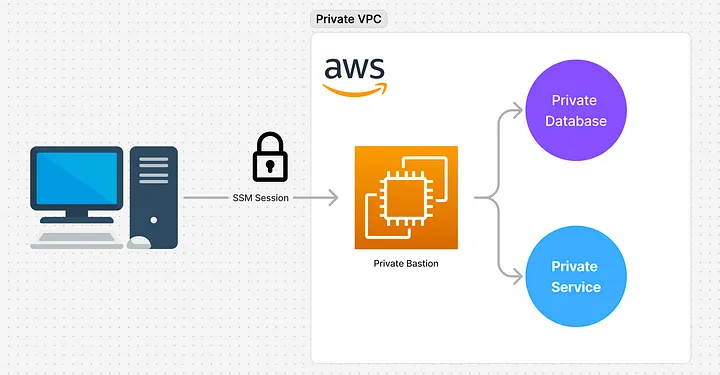
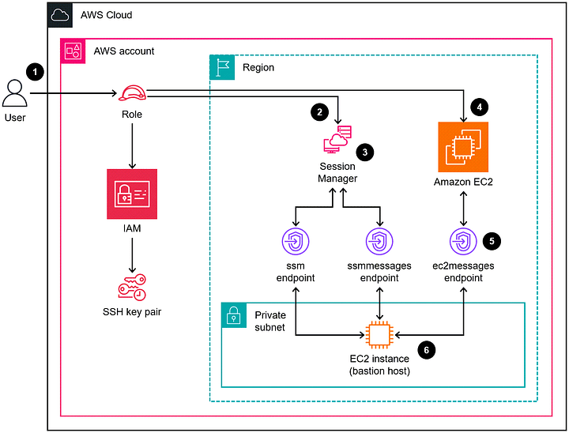
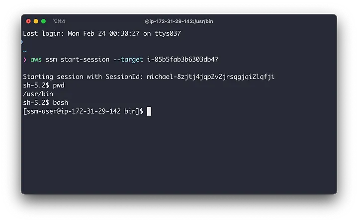

# Use SSM Session Manager Instead of SSH Key Pairs

- Using a Public EC2 Bastion to access your VPC resources through SSH from your local computer? There’s a better, more secure way and that is by leveraging Systems Manager (SSM) Session Manager.

## What is a Bastion?
- Imagine you have a database running in a private subnet on AWS, and you need to access it from home or your local computer. Since the database isn’t publicly accessible, you need a secure way in. Traditionally, this is done using a bastion host — a jump box that acts as a controlled gateway to your private network. You first connect to the bastion over a public network, and from there, access your AWS resources with restricted permissions.
- The bastion is designed to limit entry to only authorized users, typically via SSH or other secure methods — which we’ll explore next.

## Why Not use Public Bastions?
- To SSH into a public bastion, it must be exposed to the internet. This poses a security risk and unnecessary exposure to your private AWS resources. While you can strengthen security by restricting access with tight Security Group rules — limiting connections to specific IPs — your bastion still remains a potential target.
- Additionally, SSH access typically requires a Key Pair, which, if lost, could lock you out entirely. Despite multiple security layers, the fundamental issue remains: an SSH bastion must be publicly accessible, leaving it vulnerable to attacks and access risks.

## The Solution: No Public Bastions 🚀
- That’s right — your bastion does not need to be public! Instead of exposing it to the internet, you can run it entirely within a private subnet — with no public IP — while still maintaining access using AWS Systems Manager Session Manager.
- With SSM Session Manager, you can connect to your bastion securely without:
✅ Requiring an SSH Key Pair
✅ Managing Security Group rules for public access
✅ Worrying about external threats from the public internet and accidental exposures


## Let’s Dive In Into A Demo! 🏊
- To ensure your new EC2 instance remains private, it must be launched in a subnet without auto-assigned public IPv4 addresses. Here’s how to configure this in the AWS Console:
1. Navigate to VPC in the AWS Console. 
2. Go to Subnets and select the subnet where your EC2 instance will be launched. 
3. Click Actions > Edit Subnet Settings. 
4. Uncheck "Enable auto-assign public IPv4 address". 
5. Save your changes.

### Create New Private Bastion EC2 Instance
- Head over to your IDE and create a new file called [bastion.tf](./bastion.tf) and add the following resources
- Be sure to replace `YOUR_AWS_REGION` and `YOUR_PRIVATE_SUBNET_ID` with with you corresponding values.
- The following resources will create:
1. A small EC2 Instance 
2. An EC2 Instance Role 
3. A Policy Attached to the Role which allows access to SSM Service.

### Add Required VPC Interface Endpoints
- Since your bastion instance is located on a private subnet and is not directly accessible from the public internet, we need a secure method for AWS to communicate with it through the Session Manager Service. VPC Interface Endpoints enable private, direct communication between the Session Manager Service and your bastion instance, ensuring that the data never traverses the public internet.
- Let's define the endpoints by creating a file called [vpc-endpoints.tf](./vpc-endpoints.tf)
- These endpoints will be created within the same subnet as the private instance. For this demo, since we haven’t specified a security group, the default VPC security group will be used. Ensure this aligns with your security best practices, and further restrict any rules if necessary.

## Deploy Changes 🚀
- Let's deploy our infrastructure by executing the following commands
```terraform
terraform init
terraform apply
```

### Connect to Bastion using SSM Session Manager 🔌
- Be sure to have installed the Sessions Manager Plugin before executing this step.
- To connect to your bastion, execute the following command:
```shell
# Replace <EC2-INSTANCE-ID> with your private bastion EC2 Instance ID
aws ssm start-session --target <EC2-INSTANCE-ID>
```
- If everything goes well, you should be able see a live terminal session connected to your private bastion 🎉


### How do I Connect to a Database using SSM?
- Sessions Manager Plugin allows you to do Port Forwarding by creating a SSH Tunnel. Essentially, it allows you to establish a secure connection to your resource, and then forward the same or different port to your local computer on localhost.
- Here is how we would do this:
```shell
aws ssm start-session --target <RDS_DB_ENDPOINT> \
--document-name AWS-StartPortForwardingSession \
--parameters '{"portNumber":["3306"],"localPortNumber":["3306"]}'
```
- Make sure that you bastion is allowed to access your database. Then connect to your database locally using localhost:3306 and by using your database credentials.
