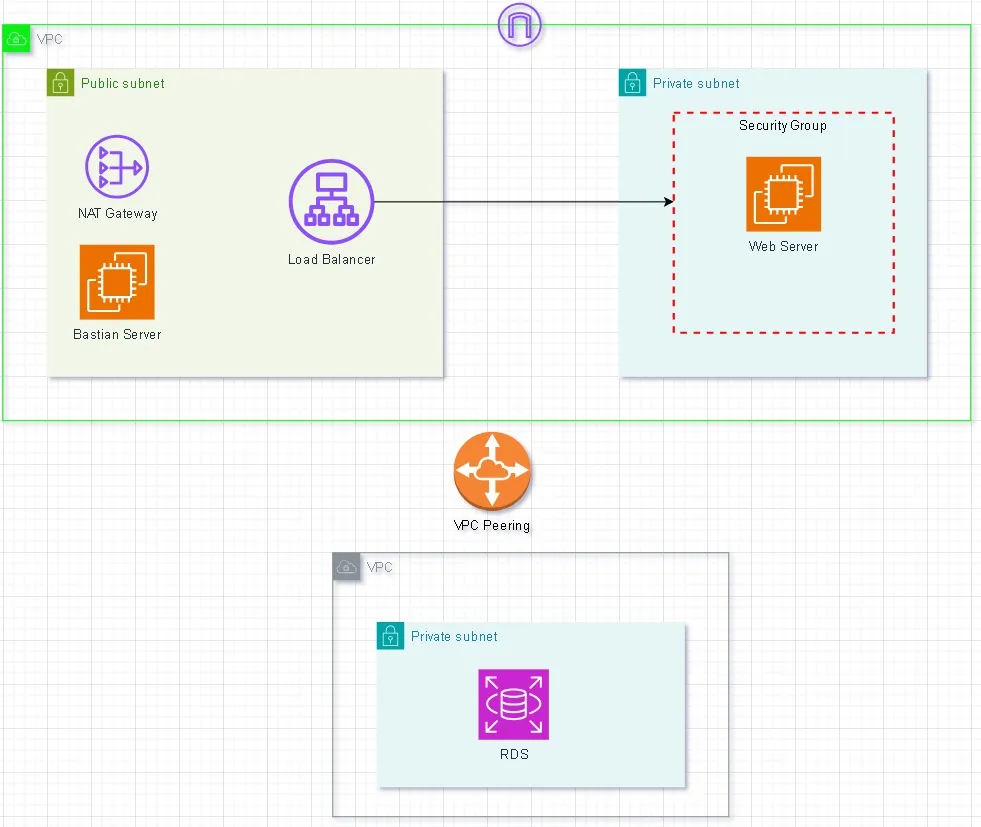

# Overview
- This design illustrates a scenario where VPC Peering is used to connect two VPCs:
  - VPC 1: Hosts a web application with an Application Load Balancer (ALB) in a public subnet and web servers in a private subnet. 
  - VPC 2: Contains a private subnet that hosts an RDS database instance
- This setup provides a secure, scalable, and efficient architecture for your web application, where the web tier and database tier are logically separated into different VPCs.
- 

## Architectural Diagram Description
- Instance VPC:
1. Public Subnet: Contains the ALB that receives traffic from the internet. 
2. Private Subnet: Contains EC2 instances running the web application. 
3. The private subnet’s route table routes traffic intended for the RDS instance to VPC 2 via the VPC peering connection.

- RDS VPC:
1. Private Subnet: Contains the RDS database instance. 
2. The private subnet’s route table routes traffic intended for the web servers to VPC 1 via the VPC peering connection.

- Key Points
1. VPC Peering provides low-latency, high-throughput connectivity between the two VPCs. 
2. Security Groups ensure that only necessary traffic is allowed between components, enhancing security. 
3. Routing must be configured to enable communication between the two VPCs across the peering connection.
